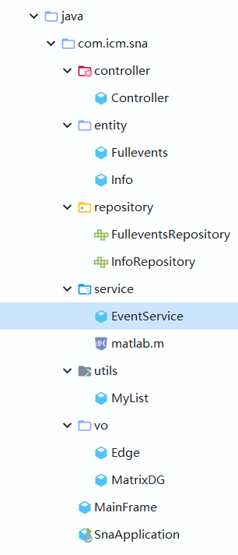
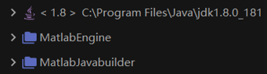
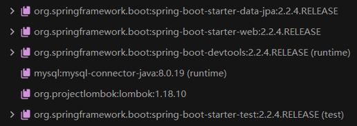
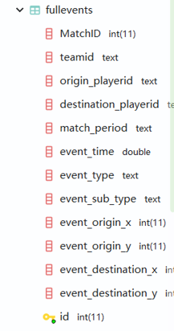
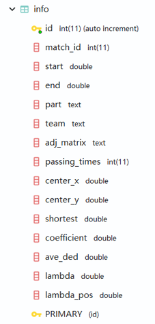

# sna
A spring data  jpa program that connects matlab doing social network analysis to solve the ICM2020 problem B.

Our Java spring data jpa program connects matlab and mysql database to process data from the table fullevents to the table info. The table fullevents is imported from the file fullevents.csv. The output is to the table info,which has been dumped into the file Appendix2.

Our essay is 2006068.pdf, all rights reserved.

1. 项目结构:

2. 项目依赖，包含maven与本地：

3. 数据表结构：

